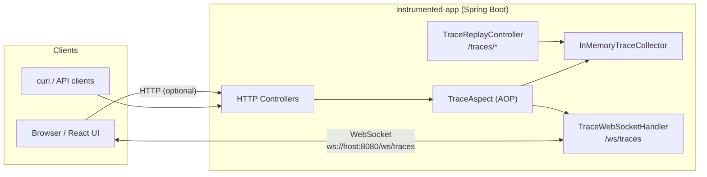
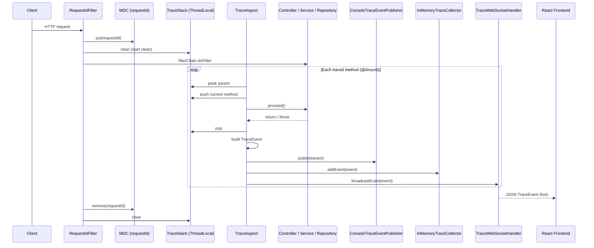
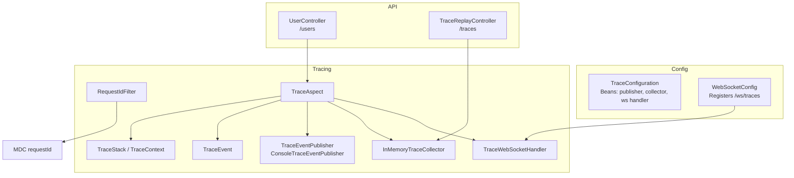
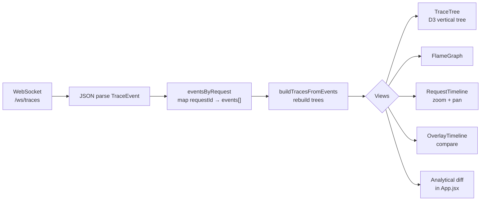
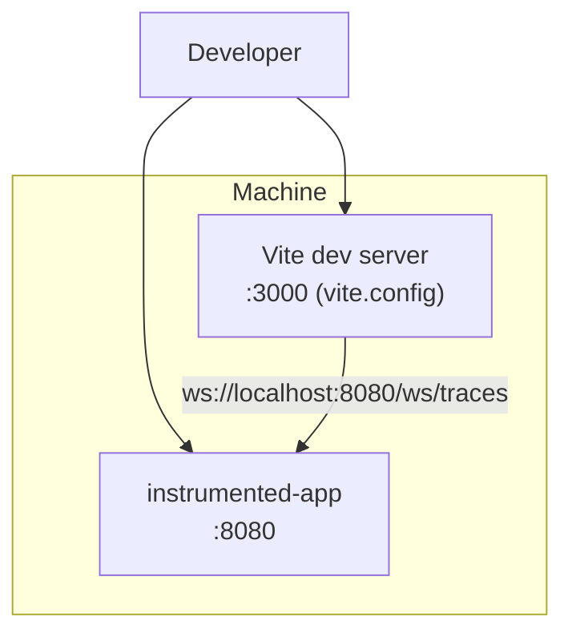

# Architecture

This document is the canonical reference for **system structure** and **data flow**. Diagrams use [Mermaid](https://mermaid.js.org/) syntax (rendered on GitHub, GitLab, many IDEs, and Markdown preview tools).

---

## 1. System context

High-level view: who talks to whom.

**Notes**

- The UI primarily consumes **WebSocket** events; HTTP to the app is used to **generate** traces (e.g. `GET /users/{id}`) and optional **REST** inspection (`/traces/...`).
- `shared-model` and `trace-collector` in the repo are placeholders for a future split (not separate deployables in the current codebase).

---

## 2. Request-scoped trace pipeline (logical)

Single HTTP request: correlation, stack, emission.

---

## 3. Backend component map

Inside `instrumented-app`.

---

## 4. Frontend data flow

From socket to trees and views.

---

## 5. Deployment view (local dev)

Typical developer setup.

**Port reminder**: Backend defaults to **8080**. Frontend Vite is configured for **3000** in `frontend/vite.config.js` (README may mention 5173 elsewhere—follow Vite config + terminal output).

---

## Related docs

- [PROJECT_DOCUMENTATION.md](../PROJECT_DOCUMENTATION.md) — full technical inventory
- [ENGINEERING_ONBOARDING.md](./ENGINEERING_ONBOARDING.md) — team handoff and operations
- [PORTFOLIO_RESUME_VERSION.md](./PORTFOLIO_RESUME_VERSION.md) — resume / portfolio framing
