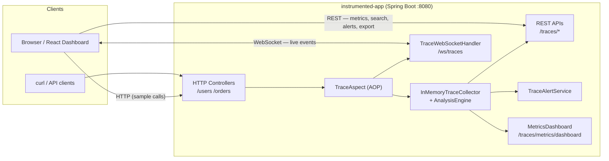
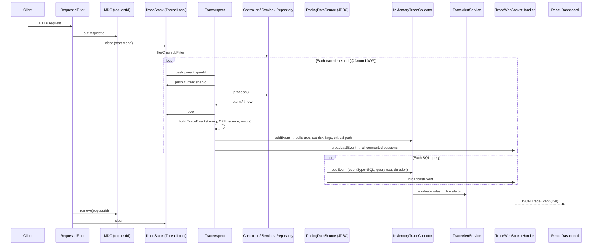
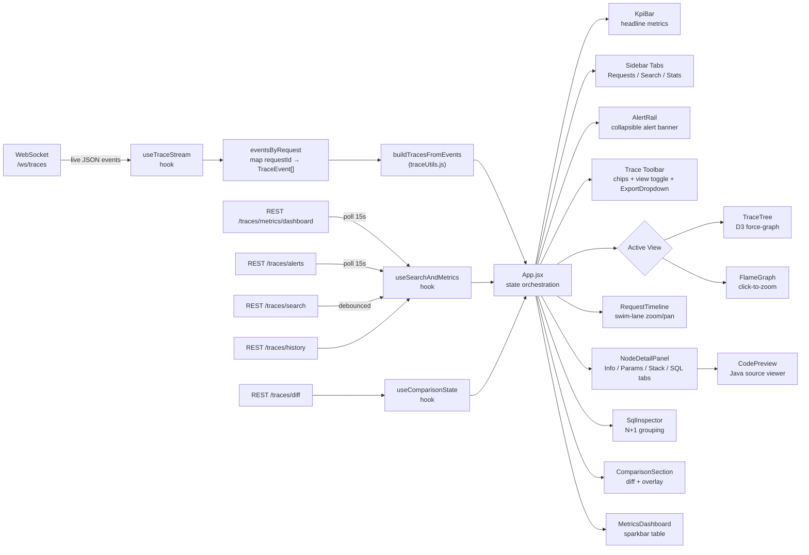
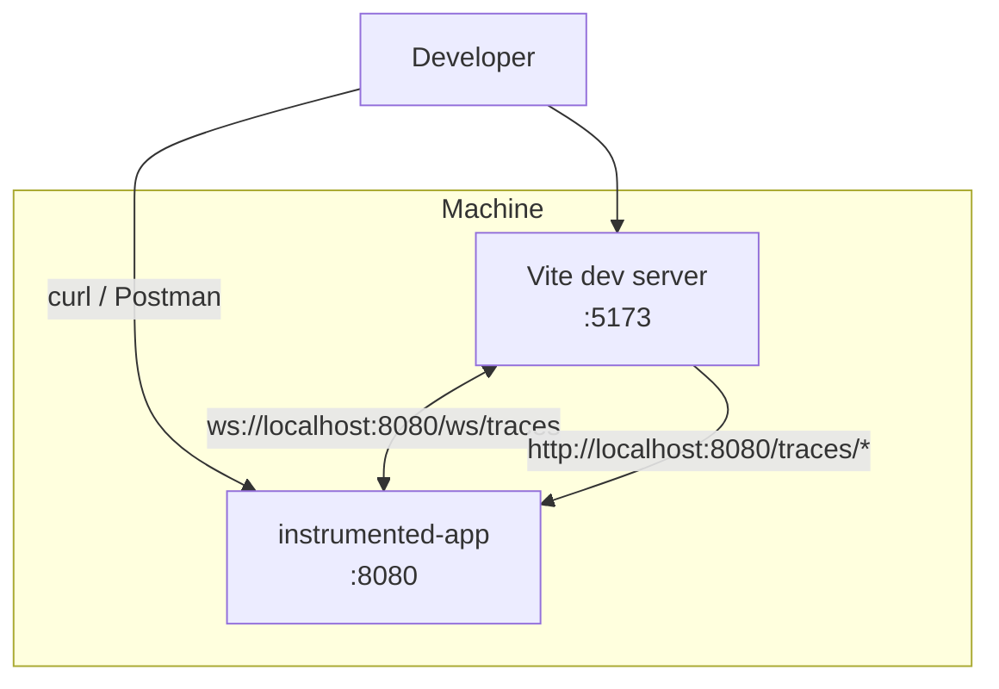

# Architecture

Canonical reference for **system structure** and **data flow**. All diagrams use [Mermaid](https://mermaid.js.org/) syntax (rendered on GitHub, GitLab, most IDEs).

---

## 1. System Context

High-level view: who talks to whom.



**Notes**
- The dashboard primarily consumes **WebSocket** events (live trace stream) and **REST** endpoints (metrics, search, alerts, exports).
- The HTTP endpoints (`/users`, `/orders`) exist purely as instrumented demo surfaces to generate interesting traces.

---

## 2. Request-Scoped Trace Pipeline

Single HTTP request: correlation → stack → emission → dashboard.



---

## 3. Backend Component Map

```mermaid
flowchart TB
    subgraph Config
        TC[TraceConfiguration\nbeans: publisher, collector, ws handler]
        WSC[WebSocketConfig\n/ws/traces]
        WAI[WebSocketAuthInterceptor\nshared-secret handshake guard]
        ATC[AsyncTraceConfig\nTaskDecorator + traceAsyncExecutor]
        GEH[GlobalExceptionHandler\nMDC-tagged JSON error responses]
        RTC[ReactorTraceContextConfig\nMono/Flux context propagation]
    end

    subgraph Tracing
        RF[RequestIdFilter\nUUID requestId → MDC]
        TS[TraceStack + TraceContext\nThreadLocal call depth]
        TA[TraceAspect\n@Around controller/service/repository]
        TE[TraceEvent\nLombok @Builder]
        IMTC[InMemoryTraceCollector\ntree + heuristics + LRU + TTL + sampling]
        TWH[TraceWebSocketHandler\nbroadcast to all sessions]
        SDR[SensitiveDataRedactor\nPII / token scrubbing]
        TAS[TraceAlertService\nrule-based alert firing]
        TRCA[TraceRootCauseAnalyzer\nhints + N+1 + anomalies]
        MET[MetricsDashboard\np50/p95/p99 per method]
        TPS[TracePersistenceService\nfile storage + share links]
        TSS[TraceSearchService\nmethod / duration / error filter]
        DSM[DistributedSpanMerger\ncross-service span merging]
    end

    subgraph Reactor
        RTCA[ReactorTraceContextAccessor\nwithTraceContext(Mono/Flux)]
    end

    subgraph SQL
        TDS[TracingDataSource]
        TCN[TracingConnection]
        TPS2[TracingPreparedStatement]
        STL[SqlTraceListener]
    end

    subgraph API
        UC[UserController /users]
        OC[OrderController /orders]
        TRC[TraceReplayController /traces/*]
    end

    RF --> TS
    TA --> TS
    TA --> TE
    TA --> SDR
    TA --> IMTC
    TA --> TWH
    TDS --> TCN --> TPS2 --> STL
    STL --> IMTC
    STL --> TWH
    IMTC --> TRCA
    IMTC --> MET
    IMTC --> TAS
    TRC --> IMTC
    TRC --> TPS
    TRC --> TSS
    WSC --> TWH
    WSC --> WAI
    UC --> TA
    OC --> TA
```

---

## 4. Frontend Data Flow



---

## 5. Frontend Component Tree

```
App.jsx
├── Header (live indicator + ev/s counter + alerts badge + pause/clear)
├── KpiBar (Live Traces · Error Rate · Peak p99 · Active Alerts)
├── Sidebar
│   ├── Tab bar (Requests / Search / Stats)
│   ├── [Requests] request list + filters + health badges + bookmarks
│   ├── [Search]   method/duration/error filter + results + history
│   └── [Stats]    MetricsDashboard (sparkbar table)
└── Main
    ├── AlertRail (collapsible, per-alert dismiss)
    ├── Toolbar (request ID · summary chips · view toggle · compare · ExportDropdown)
    ├── AnalysisBanner (root-cause hints, N+1 warnings, anomalies)
    ├── TraceTree  OR  FlameGraph
    ├── RequestTimeline (zoom/pan swimlane)
    ├── NodeDetailPanel (Info / Params / Stack Trace / SQL tabs)
    │   └── CodePreview (inline Java source viewer — shown when sourceFile + sourceLine available)
    ├── SqlInspector (when SQL spans present)
    └── ComparisonSection (when compare request selected)
```

---

## 6. Deployment View (Local Dev)



**Port reference:**
- Backend: **8080** (Spring Boot default)
- Frontend: **5173** (Vite default, configurable via `VITE_PORT`)

**WebSocket auth:** `WebSocketAuthInterceptor` is a transparent pass-through when `auth-token: none` (default). Set it to any non-`none` value and the interceptor rejects upgrades without a matching `?token=` query parameter.

---

## 7. Key Design Decisions

| Decision | Rationale |
|----------|-----------|
| `spanId` / `parentSpanId` for tree linkage | Eliminates ambiguity from duplicate method names; matches OpenTelemetry conventions |
| Raw events stored, trees rebuilt client-side | Tolerates out-of-order WebSocket delivery without server-side ordering guarantees |
| LRU + TTL dual eviction | Bounds memory by both count and age independently |
| Heuristic risk flags | Best-effort signals (not formal static analysis) — cheap to compute, useful in practice |
| Polling for metrics/alerts (not WebSocket) | Metrics are aggregate state, not event streams — REST polling is simpler and sufficient |
| HTML-escape before syntax highlighting (`CodePreview`) | Java generics (`List<String>`) and other angle-bracket code would corrupt the DOM if injected raw; escaping first then wrapping with `<span>` keeps it safe |
| `GlobalExceptionHandler` returns `requestId` | Lets engineers correlate an error response with the exact trace that produced it — no log search required |
| Reactor context utilities shipped but not exercised | Provides the scaffolding for reactive tracing without forcing a WebFlux migration; ready to activate without architecture changes |

---

## Related Docs

- [PROJECT_DOCUMENTATION.md](../PROJECT_DOCUMENTATION.md) — full technical inventory and API reference
- [ENGINEERING_ONBOARDING.md](./ENGINEERING_ONBOARDING.md) — developer guide, glossary, extension playbook
- [FEATURES.md](./FEATURES.md) — complete feature checklist
- [PORTFOLIO_RESUME_VERSION.md](./PORTFOLIO_RESUME_VERSION.md) — resume / portfolio framing
